# Разработка электронной базы животных без владельцев

---

# Features

* База данных
* Интерфейс для взаимодействия с БД
* API интерфейс
* Разные уровни доступа
* Готовность к социализации
* Карточки животного
* Формирование отчётов

---

# Images
## База данных
Содержит перечень необходимых справочников и данные пользователей для авторизации.

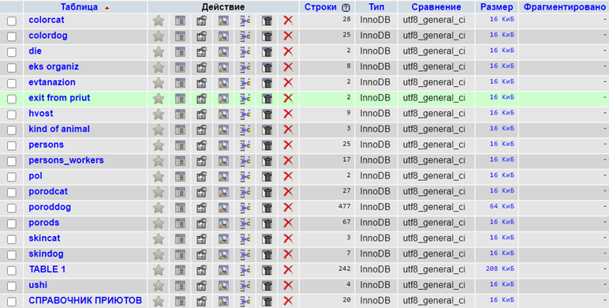
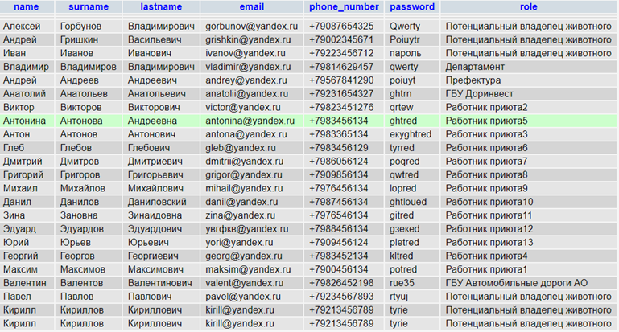

## Интерфейс для взаимодействия
Возможность взаимодействия с базой данных.

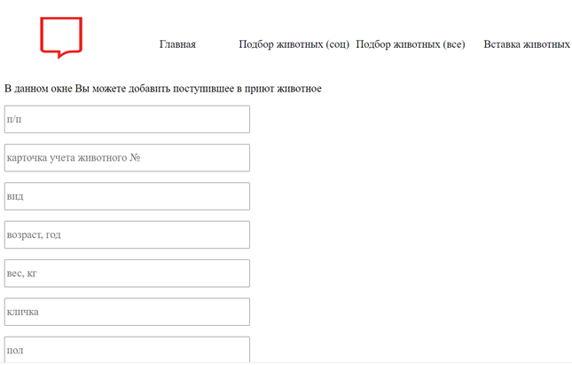
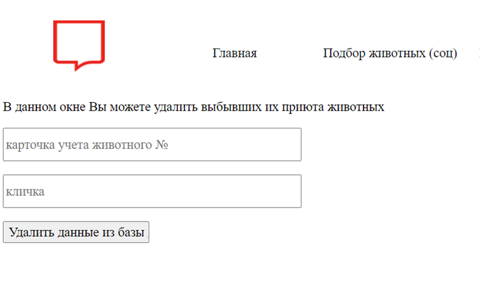
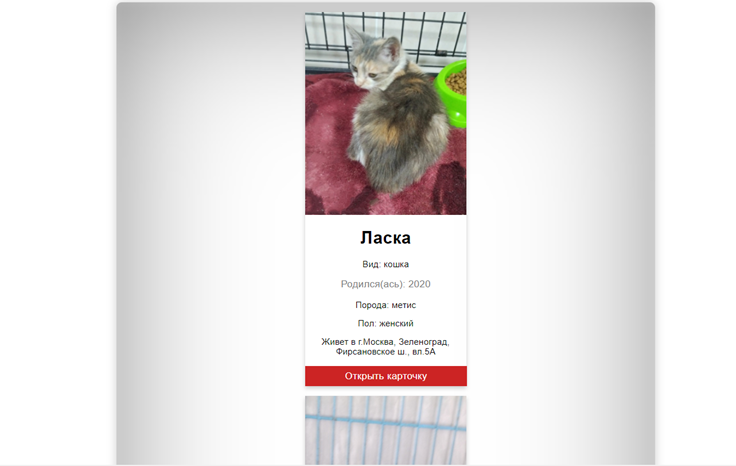
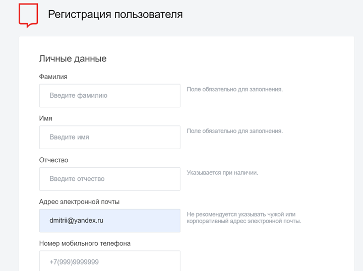
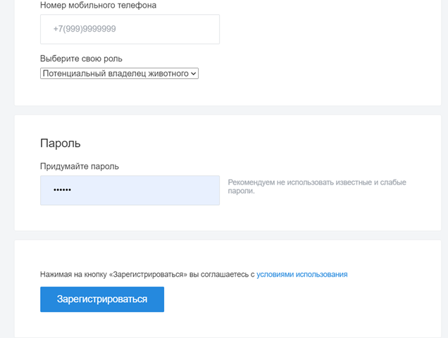
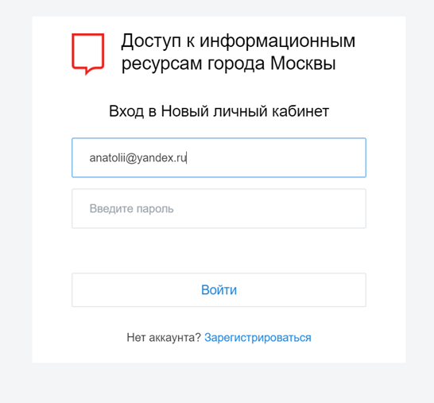

## API интерфейс
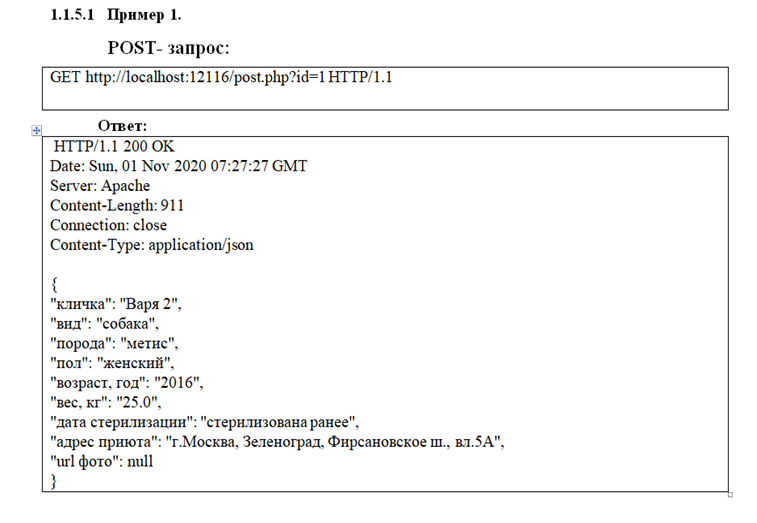

## Разные уровни доступа к социализации 

### Потенциальный владелец животного

### ГБУ Доринвест и Префектура

### Работник приюта

### Департамент и ГБУ Автомобильные дороги АО 

## Карточки животного
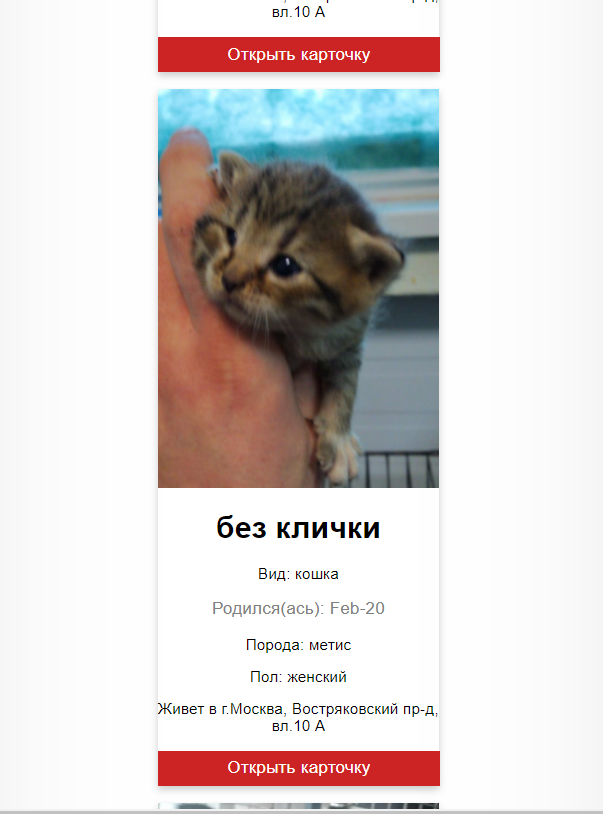
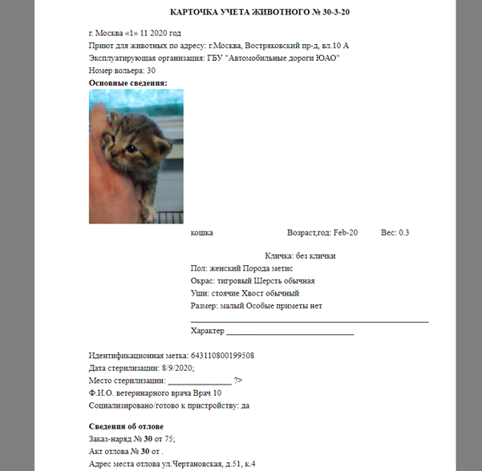
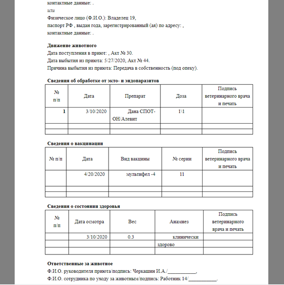

## Форма отчётов
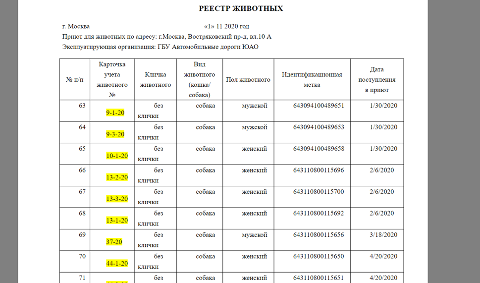
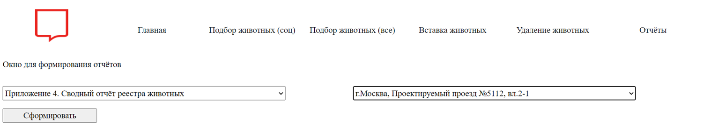

---

# Tech
* HTML
* CSS
* PHP
* JavaScript
* Python
* MySQL
* OpenServer
---
# Developers
* Баканова М.В.
* Новаков Н.Ю.
* Макаров Д.В.
---

